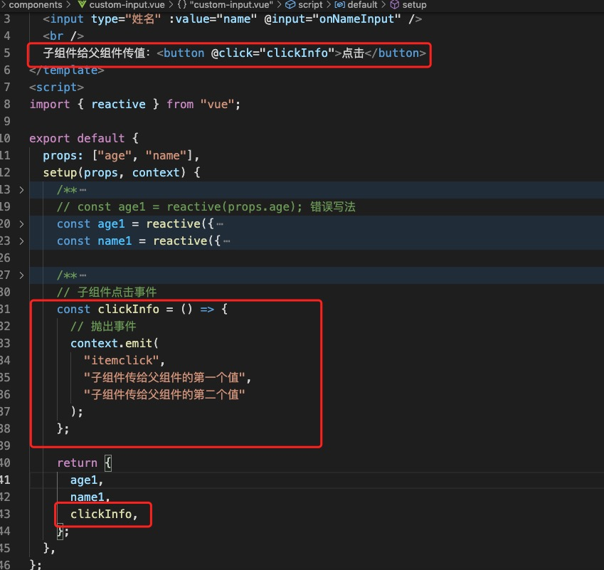
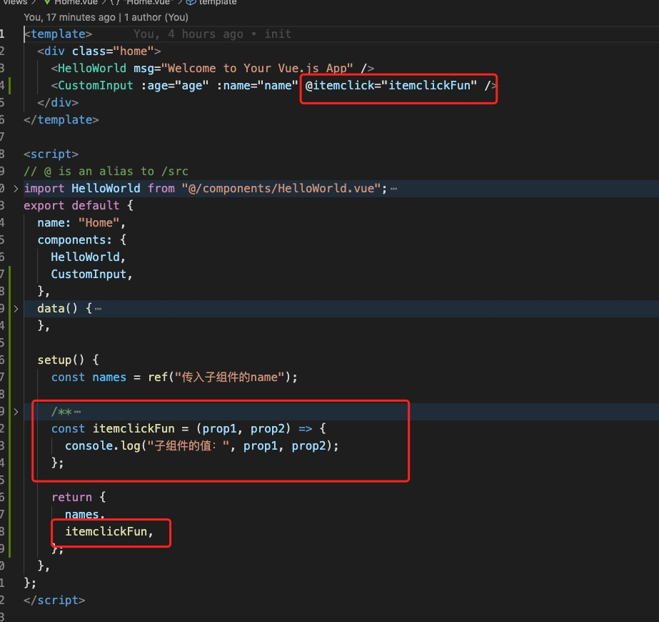
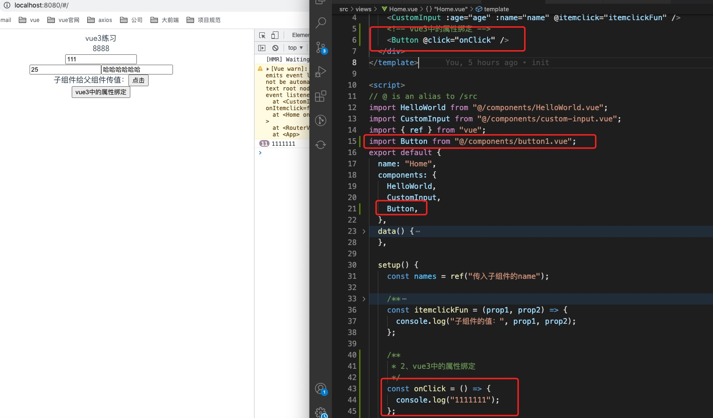
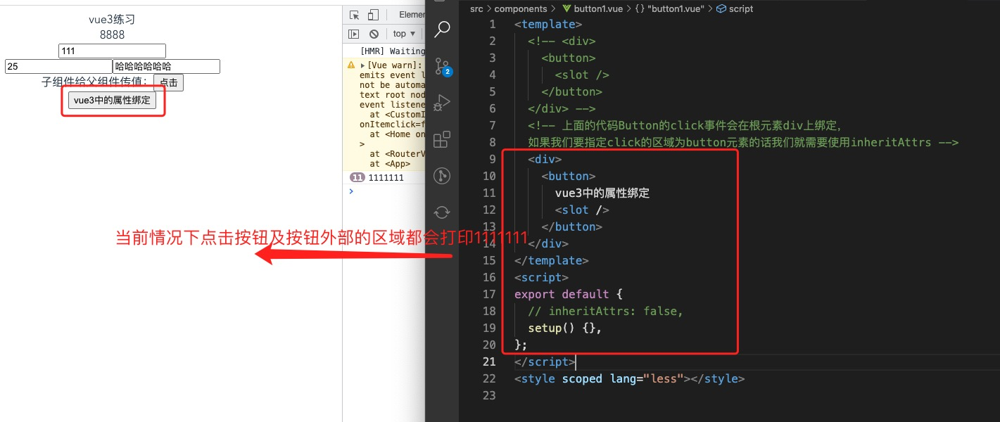
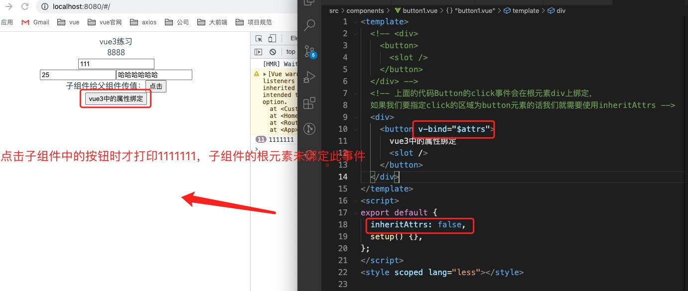
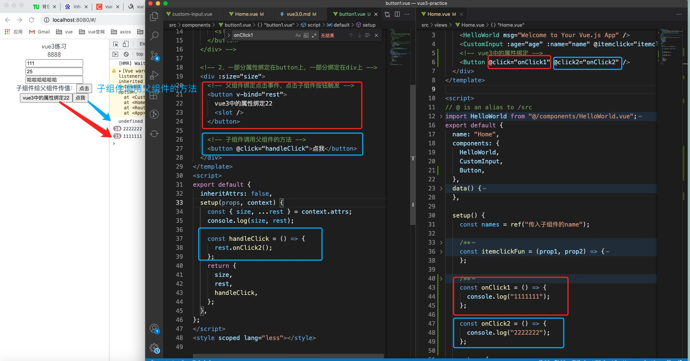

# 一、vue2和vue3的区别
  ## 1.vue3的Template支持多个根标签，vue2不支持

  ## 2.vue3有createApp(),而vue2是new vue()
     格式如下：
       createApp(组件)，new Vue({template, render})

  ## 3.v-model代替以前的v-model和.sync
  - Home.vue文件中
    ```html
      <template>
        <div id="app">
          <h1>Vue3中v-model的变化</h1>
          <input type="text" v-model="name"/>
          <p>{{ name }}</p>
          <!-- Vue2的写法 -->
          <!-- v-model实际上就是:value和@input的语法糖 -->
          <!-- 双向绑定多个属性的时候可以使用.sync关键字 -->
          <CustomInput v-model="age" :name.sync="name"/>
          <!-- Vue3的写法 -->
          <CustomInput v-model:age="age" v-model:name="name"/>
        </div>
      </template>

    ```

    ```js
      import CustomInput from "../components/CustomInput.vue";
      export default {
        name: "App",
        components: {
          CustomInput
        },
        data() {
          return {
            name: "你好",
            age: 20,
          }
        },
      }
    ```
  - custom-input.vue文件中
  ```html
    <template>
    <div class="custom-input">
      <h1>自定义的input</h1>
      <!-- Vue2的写法 -->
      <input type="text" :value="value" @input="onInput" />
      <input type="text" :value="name" @input="onNameInput" />
      <!-- Vue3的写法 -->
      <input type="text" :value="age" @input="onInput" />
      <input type="text" :value="name" @input="onNameInput" />
    </div>
  </template>
  ```
  ```js
      // Vue2的写法
      props: ["value", "name"],
      // Vue3的写法,直接接收绑定的参数
      props: ["age", "name"],
      // Vue3双向绑定单个属性时，可以使用modelValue来接收参数并更新,对应的触发事件为update:modelValue
      props: ["modelValue"],
      methods: {
        onInput(e) {
          // Vue2的写法
          // 触发的事件只能是input
          // e.target.value是字符串需要转换成数字
          this.$emit("input", parseInt(e.target.value));
          // Vue3的写法
          this.$emit("update:age", e.target.value);
        },
        onNameInput(e) {
          // 只能用update
          this.$emit("update:name", e.target.value);
        },
      },
    }
  ```

  ## 4.context.emit
    新增context.emit，与this.$emit（vue3中只能在methods里使用）作用相同
  - 子组件中
    
    
  - 父组件中
    

  ## 5.vue3中的属性绑定
   - 在vue2中我们在父组件绑定click事件，子组件必须内部触发click，而vue3中在父组件绑定子组件的根元素上也会跟着绑定
   - $attrs 属性解释:包含了父作用域中不作为组件 props 或自定义事件的 attribute 绑定和事件。当一个组件没有声明任何
   prop 时，这里会包含所有父作用域的绑定，并且可以通过 v-bind="$attrs" 传入内部组件——这在创建高阶的组件时会非常有用。
   - inheritAttrs属性解释：如果你不希望组件的根元素继承特性，你可以在组件的选项中设置 inheritAttrs: false

   - 父组件
   

   - 子组件（子组件的根元素也绑定事件的情况）
   

   - 子组件（子组件的根元素不绑定事件的情况）
    
  
   - 子组件 （如果想要一部分属性绑定在button上一部分在div上就需要在setup里）
   

